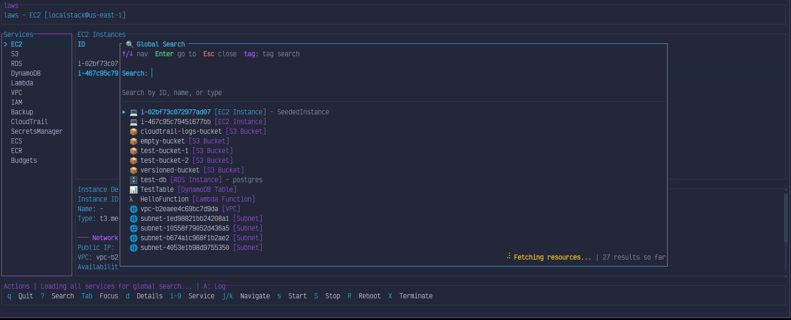
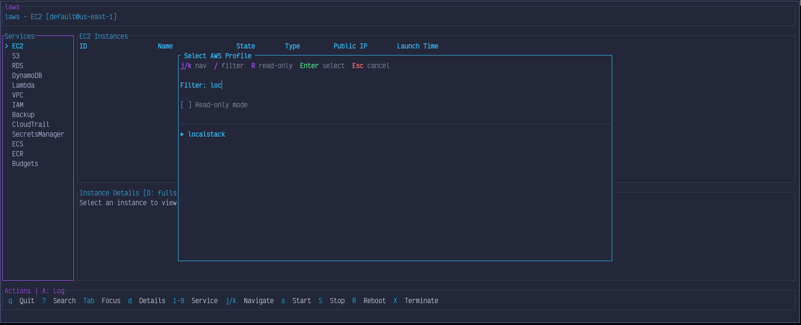
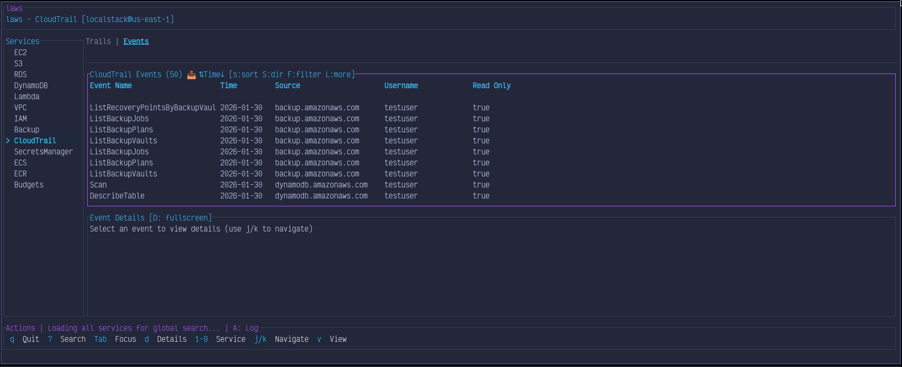

# laws

A keyboard-driven TUI for AWS. Think [lazygit](https://github.com/jesseduffield/lazygit) meets the AWS Console.

Built with Rust + Ratatui. Vim-style navigation. Fully async.

Screenshots:





---

> [!CAUTION]
> **Use at your own risk.** I built this as a personal tool while learning Rust and using it as a testbed for AI coding agents (Antigravity, Kiro, etc). I'm not a Rust expert. There's probably some questionable code in here. It works for me, but your mileage may vary.

> [!NOTE]
> **PRs, Issues, and Discussions are welcome!** That said, I may take a while to get around to them. Kids are crazy and I have a few of them. This is a side project, not my job.

---

## What is this?

`laws` is a terminal-based interface for managing your AWS resources without leaving the command line. If you're tired of clicking through the AWS Console or juggling `aws-cli` commands, this might be for you.

**What you can do:**

- Browse and manage EC2 instances, S3 buckets, RDS databases, Lambda functions, and more
- Start, stop, reboot, and delete resources (with confirmation prompts, I'm not a monster)
- View and edit S3 objects directly
- Invoke Lambda functions with custom payloads
- Switch between AWS profiles and regions on the fly
- Search across all your resources with global search and tag filtering
- Read-only mode when you just want to look, not touch

**Currently supported services:**
EC2 • S3 • RDS • DynamoDB • Lambda • VPC • IAM • ECS • ECR • Backup • CloudTrail • Secrets Manager

---

## Install

You'll need Rust 1.75+ installed.

```/dev/null/install.sh#L1-8
# Clone and build
git clone https://github.com/yourusername/laws.git
cd laws
cargo build --release

# Run it
./target/release/laws
```

Or if you just want to try it:

```/dev/null/cargo_run.sh#L1-1
cargo run --release
```

---

## Usage

```/dev/null/usage.sh#L1-6
laws                                    # Opens profile switcher on first run
laws -p prod                            # Use a specific AWS profile
laws -p prod -r eu-west-1               # Specify region too
laws -p prod --read-only                # Safe mode - no destructive actions
laws --endpoint-url http://localhost:4566  # LocalStack support
```

---

## Keybindings

Everything is keyboard-driven. If you've used Vim or lazygit, you'll feel right at home.

### Navigation

| Key                 | Action                                 |
| ------------------- | -------------------------------------- |
| `j` / `k`           | Move down / up                         |
| `g` / `G`           | Jump to top / bottom                   |
| `Enter`             | Drill into selection                   |
| `Esc` / `Backspace` | Go back                                |
| `Tab`               | Toggle focus: sidebar ↔ main panel    |
| `1-9`               | Jump directly to service (by position) |
| `/`                 | Filter current list / Global search    |
| `?`                 | Search by tags                         |

### Actions

| Key       | Action                                  |
| --------- | --------------------------------------- |
| `s` / `S` | Start / Stop resource                   |
| `R`       | Reboot                                  |
| `x`       | Delete (don't worry, it asks first)     |
| `y`       | Copy selection to clipboard             |
| `e`       | Edit (S3 objects, ECS task definitions) |
| `i`       | Invoke (Lambda functions)               |

### Views & Navigation

| Key              | Action                                  |
| ---------------- | --------------------------------------- |
| `d` / `D`        | Toggle detail panel / Fullscreen detail |
| `v` or `h` / `l` | Cycle through views/tabs                |
| `P`              | Open profile & region switcher          |
| `A`              | Toggle action log                       |
| `r`              | Refresh current view                    |
| `q`              | Quit                                    |

---

## Configuration

Config lives at `~/.config/laws/config.toml`:

```/dev/null/config.toml#L1-4
theme = "dark"          # dark, light, monokai, nord
tick_rate_ms = 250      # UI refresh rate
api_timeout_secs = 30   # AWS API timeout
```

---

## Architecture

Hybrid TEA (The Elm Architecture) + Component pattern. About ~25k lines of Rust.

```/dev/null/architecture.txt#L1-16
src/
├── app/     # State management, messages, input handling, update logic
├── aws/     # AWS SDK wrappers
├── models/  # Data structures
├── ui/      # Ratatui rendering (screens, components)
└── utils/   # Helper utilities
```

If you want the deep dive, check out [AGENTS.md](AGENTS.md) - it's the guide I wrote for AI agents (and humans) working on this codebase.

---

## License

MIT - do whatever you want with it.
